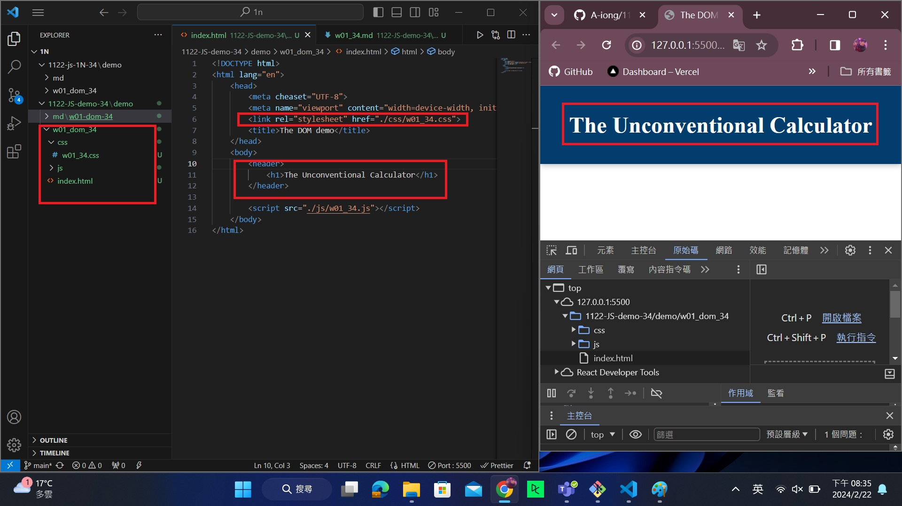
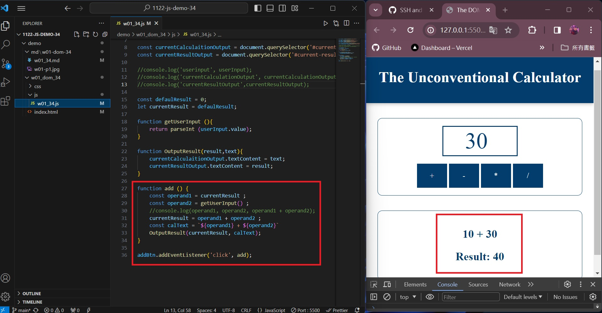
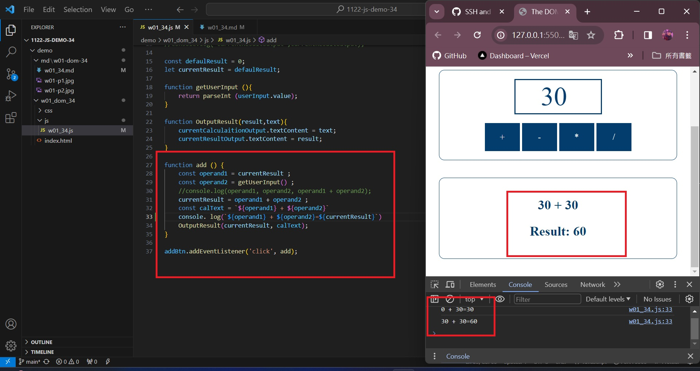
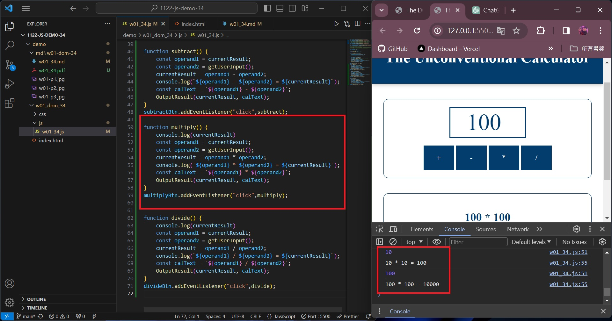
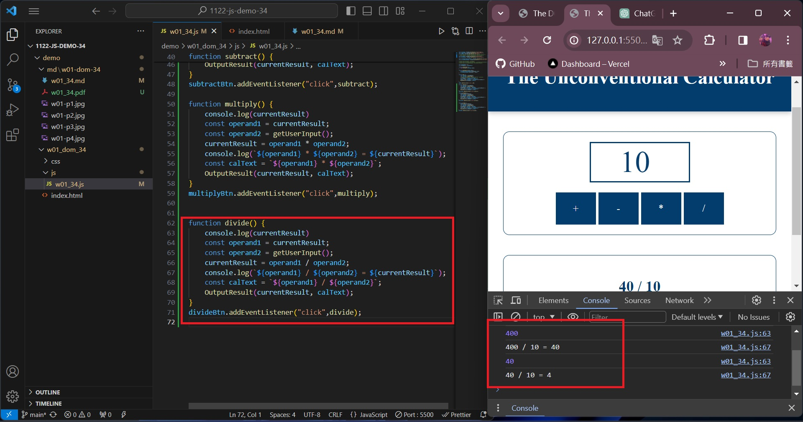

### w01-P1: show the w01-dom title

0b0a7c3 A-iong  Fri Feb 23 01:49:19 2024 +0800  w01-P1: show the w01-dom title

### w01-p2: implement ad function

0083861 A-iong  Sun Feb 25 12:34:37 2024 +0800  w01-p2: implement ad function

### w01-p3: implement subtract function

3a2febe A-iong  Sun Feb 25 12:50:53 2024 +0800  w01-p3: implement subtract function

### W01-P4: implement multiply function
 

 
### W01-P5: implement divide function
|

### w01-logs

git log --pretty=format:"%h%x09%an%x09%ad%x09%s" --after="2024-02-20"