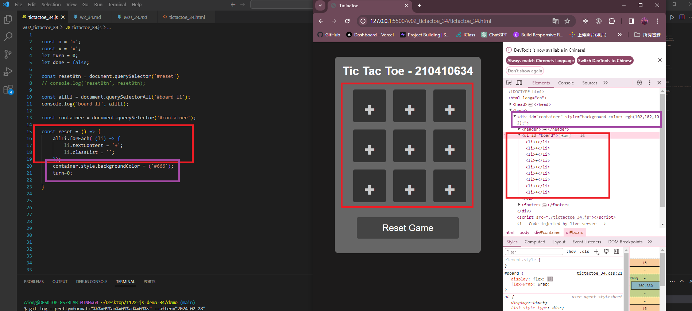

###  W02-P1: show Tictactoe css

9fa2c5e A-iong  Thu Feb 29 19:59:20 2024 +0800  W02-P1: show Tictactoe css

###  W02-P2: implement reset button

ac58af8 A-iong  Thu Feb 29 23:51:16 2024 +0800  W02-P2: implement reset button

 ### W02-P3: implment checkWin(player), and winMessage(player)

 #### => player O wins
 

 #### => player X wins
 

 
#### => tie game
 

