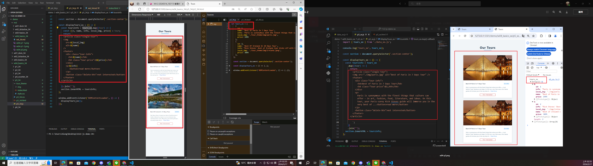
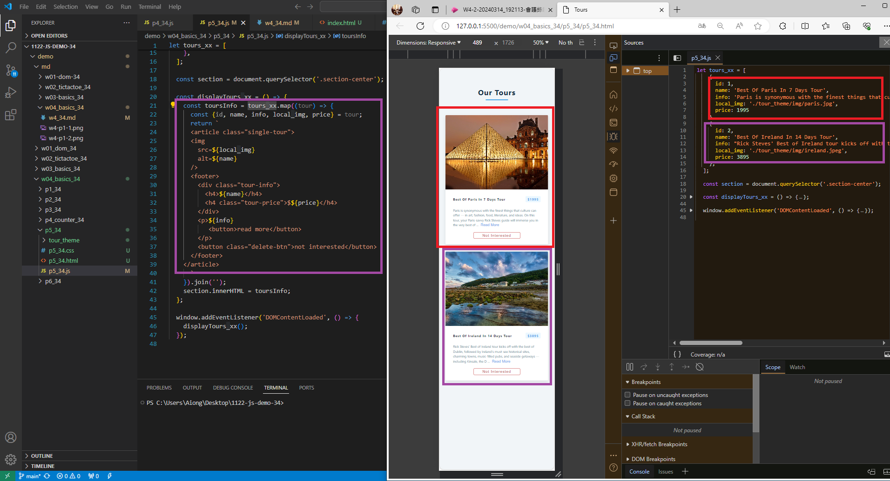
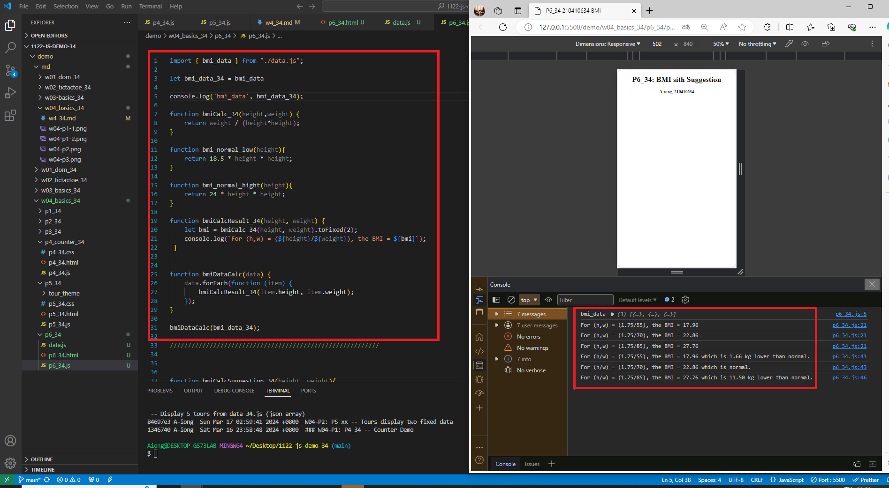
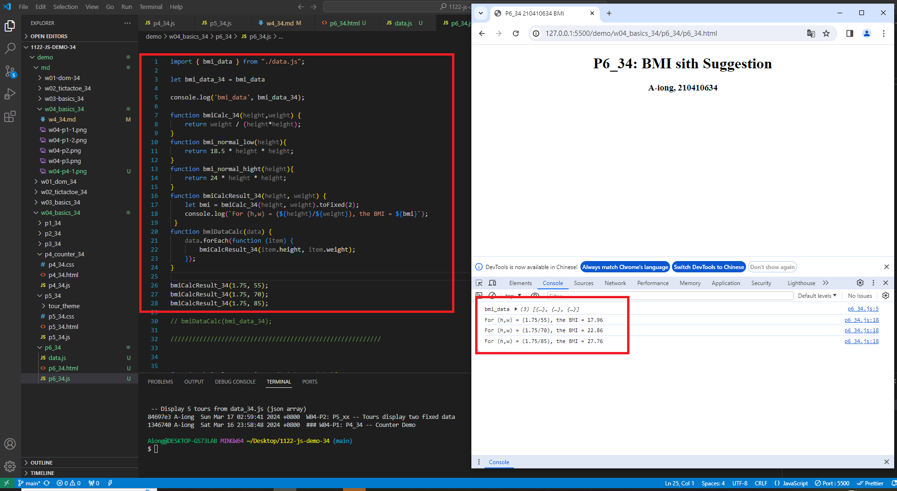

### W04-P1: P4_34 -- Counter Demo
 

 


1346740 A-iong  Sat Mar 16 23:58:48 2024 +0800  ### W04-P1: P4_34 -- Counter Demo

### W04-P2: P5_34 -- Tours display two fixed data
 
 

84697e3 A-iong  Sun Mar 17 02:59:41 2024 +0800  W04-P2: P5_xx -- Tours display two fixed dat

 ## W04-P3: P5_34 -- Display 5 tours from data_34.js (json array)
 


5cfd80d A-iong  Sun Mar 17 03:02:06 2024 +0800  W04-P3: P5_34 -- Display 5 tours from data_34.js (json array)

## W04-P4: P6_xx -- BMI Compute with Suggestion
 
#### => bmiDataCalc(bmi_data_xx);
 

 
#### => bmiDataCalcSuggestion(bmi_data_xx);
 

 
```
6763b5 A-iong  Sun Mar 17 15:21:45 2024 +0800  W04-P4: P6_xx -- BMI Compute with Suggestion

### W04-P5: git logs for W04

a6763b5 A-iong  Sun Mar 17 15:21:45 2024 +0800  W04-P4: P6_xx -- BMI Compute with Suggestion
5cfd80d A-iong  Sun Mar 17 03:02:06 2024 +0800  W04-P3: P5_34 -- Display 5 tours from data_34.js (json array)
84697e3 A-iong  Sun Mar 17 02:59:41 2024 +0800  W04-P2: P5_xx -- Tours display two fixed data
1346740 A-iong  Sat Mar 16 23:58:48 2024 +0800  ### W04-P1: P4_34 -- Counter Demo