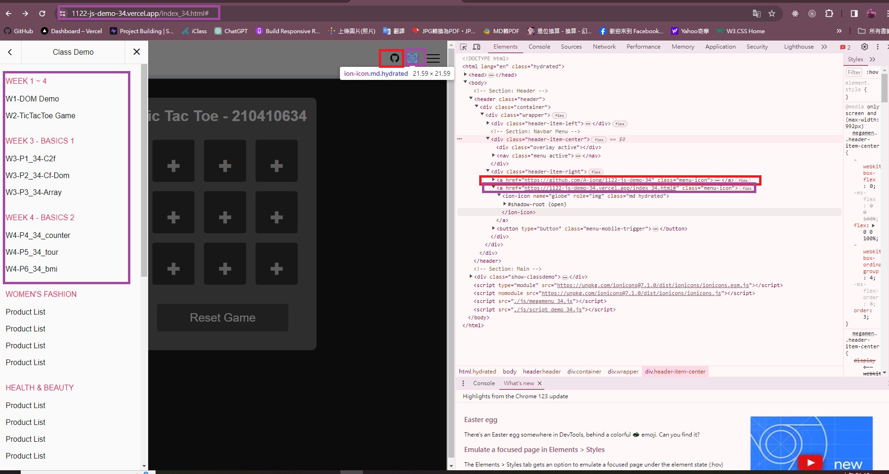
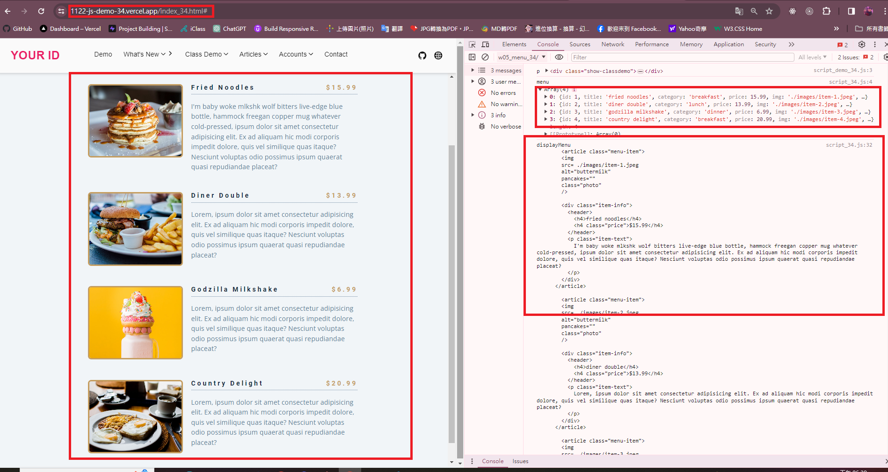

###  W05-P1: Use megamenu to show class demo w1~W4 locally


ea7566b A-iong  Sat Mar 23 18:45:07 2024 +0800  W05-P1: Use megamenu to show class demo w1~W4 locally


### W05-P2: Show W05-P1 in Vercel, add github and globe icons for Github and Vercel
 


03efea5 A-iong  Sun Mar 24 01:22:31 2024 +0800  W05-P2: Show W05-P1 in Vercel, add github and globe icons for Github and Vercel

### W05-P3: Display Menu Items from menu json array on both local and Vercel
 
#### > local
 

 
#### > Vercel
 

 
```
4370ea9 A-iong  Sun Mar 24 18:37:25 2024 +0800  W05-P3: Display Menu Items from menu json array on both local and Verce

### W05-P4: Display Menu buttons from categories array (do it by yourself)

(老師影片沒有截圖內容)~~~~QQ


####  W05-P5: git logs for W5

4370ea9 A-iong  Sun Mar 24 18:37:25 2024 +0800  W05-P3: Display Menu Items from menu json array on both local and Verce
03efea5 A-iong  Sun Mar 24 01:22:31 2024 +0800  W05-P2: Show W05-P1 in Vercel, add github and globe icons for Github and Vercel
574b16a A-iong  Sun Mar 24 01:17:57 2024 +0800  add github and globe icons
ca4eebd A-iong  Sun Mar 24 01:07:18 2024 +0800  add github and globe icons
ea7566b A-iong  Sat Mar 23 18:45:07 2024 +0800  W05-P1: Use megamenu to show class demo w1~W4 locally