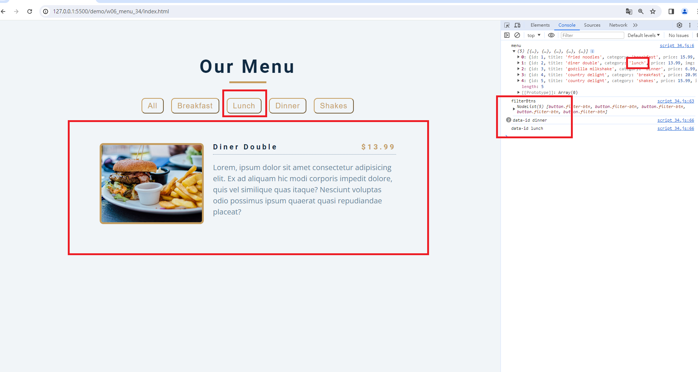

### W06-P1: Create categories dynamically from data_xx.js
 


e3e65d8 A-iong  Thu Mar 28 23:00:40 2024 +0800  W06-P1: Create categories dynamically from data_xx.js

### W06-P2: Display Menu buttons from categories array
 

 
```
8cc9ae8 A-iong  Fri Mar 29 22:38:53 2024 +0800  W06-P2: Display Menu buttons from categories array

### W06-P3: implement filter buttons
 
#### => choose breakfast
 

 
#### => choose shakes
 

 
#### => choose all
 

 
```
e9d06af A-iong  Fri Mar 29 23:49:36 2024 +0800  W06-P3: implement filter buttons
 

### W06-P4: implement open modals
 

 
```
b73d194 A-iong  Sat Mar 30 00:40:14 2024 +0800  W06-P4: implement open modals

```
