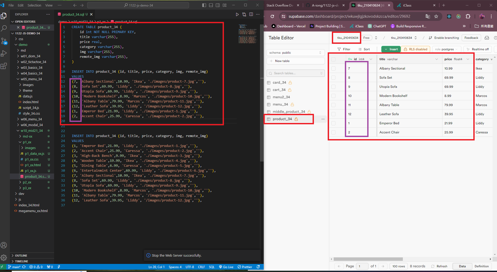
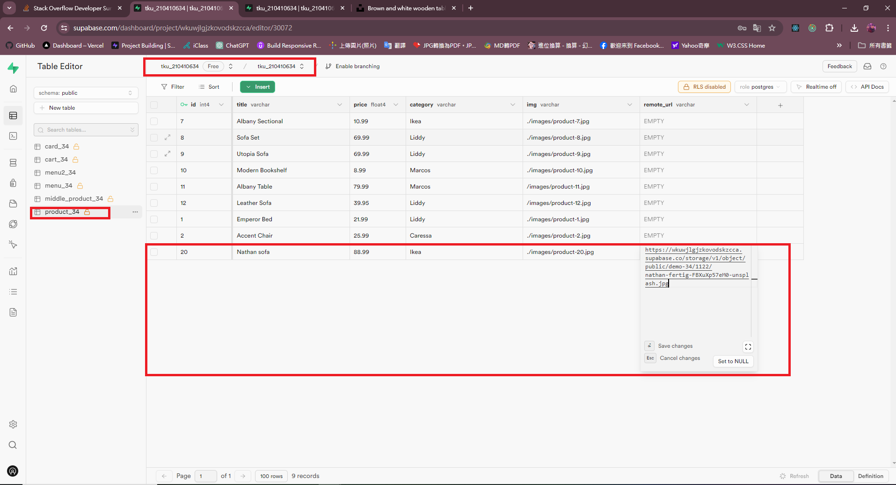
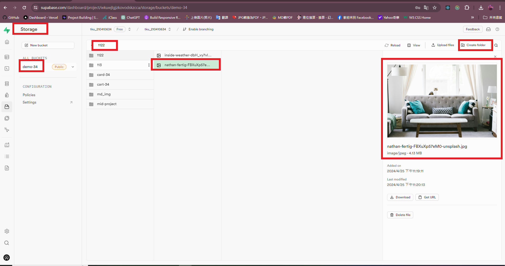
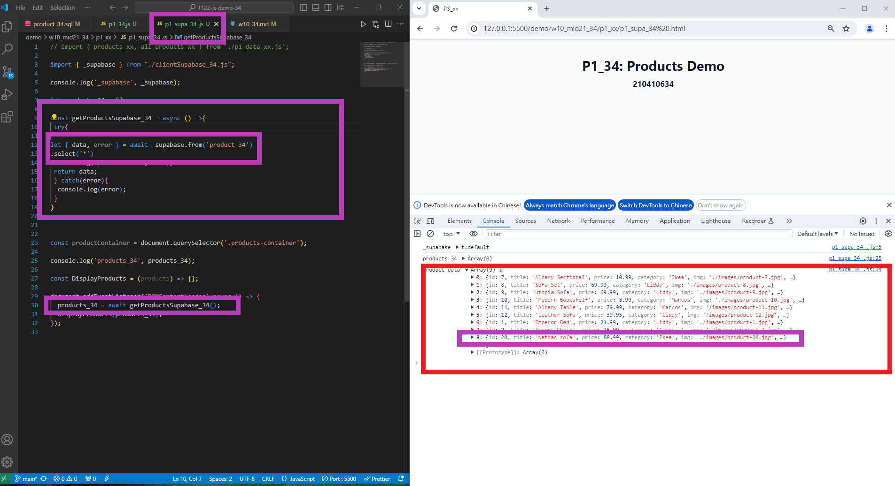
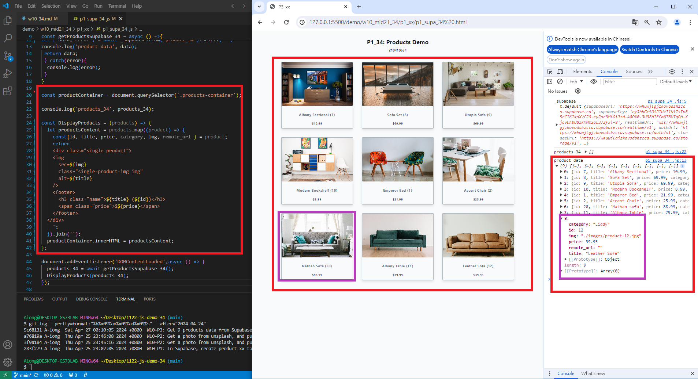

### W10-P1: In Supabase, create product_xx table with 8 product data
 


283f279 A-iong  Thu Apr 25 23:02:05 2024 +0800  W10-P1: In Supabase, create product_xx table with 8 product data


### W10-P2: Get a photo from unsplash, and put it into storage in Supabase
 





a76819a A-iong  Thu Apr 25 23:46:08 2024 +0800  W10-P2: Get a photo from unsplash, and put it into storage in Supabase
3f9a184 A-iong  Thu Apr 25 23:45:16 2024 +0800  W10-P2: Get a photo from unsplash, and put it into storage in Supabase

### W10-P3: Get 9 products data from Supabase, and show in console
 

 
```
5c68131 A-iong  Sat Apr 27 00:10:05 2024 +0800  W10-P3: Get 9 products data from Supabase, and show in console

### W10-P4: Show products retrieved from Supabase
 


