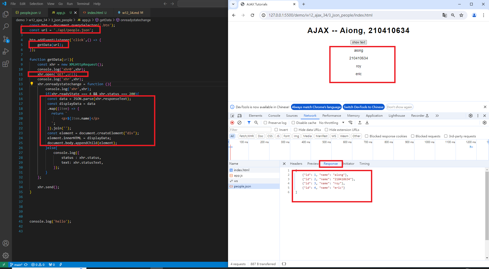

### W12-P1: Do 1_simple-text
 

 
```
2abc503 A-iong  Fri May 10 22:40:23 2024 +0800  W12-P1: Do 1_simple-text
```
### W12-P2: Do 2_add_btn

#### =>Network, Header
 

 
 #### =>Network, Response
 


```
614ce66 A-iong  Fri May 10 23:08:45 2024 +0800  W12-P2: Do 2_add_btn

```

### W12-P3: Do 3_json_people_xhr
 


 ```
e8c2e42 A-iong  Fri May 10 23:38:30 2024 +0800  W12-P3: Do 3_json_people_xhr

```

### W12-P4: Do 3_json_people_fetch_api
 
#### => fetch(url).then(response => response.json())
 

 
#### => fetch api vs.xhr
 

 
c7f399f A-iong  Sat May 11 00:16:03 2024 +0800  W12-P4: Do 3_json_people_fetch_api


### W12-P5: Do 3_json_people_async_await
 

 
```
1038aa3 A-iong  Sat May 11 00:32:11 2024 +0800  W12-P5: Do 3_json_people_async_await

```

### W12-P6: git logs for W12

1038aa3 A-iong  Sat May 11 00:32:11 2024 +0800  W12-P5: Do 3_json_people_async_await
c7f399f A-iong  Sat May 11 00:16:03 2024 +0800  W12-P4: Do 3_json_people_fetch_api
e8c2e42 A-iong  Fri May 10 23:38:30 2024 +0800  W12-P3: Do 3_json_people_xhr
614ce66 A-iong  Fri May 10 23:08:45 2024 +0800  W12-P2: Do 2_add_btn
2abc503 A-iong  Fri May 10 22:40:23 2024 +0800  W12-P1: Do 1_simple-text