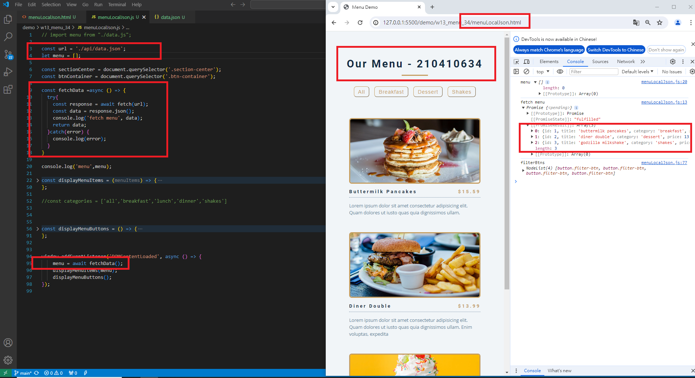

### W13-P1: Get 3 menu data from /api/data_xx.json
 


```
c9566b6 A-iong  Sat May 18 14:32:43 2024 +0800  W13-P1: Get 3 menu data from /api/data_xx.json

```

### W13-P2: Create 3 menu data from Supabase
 
#### => create menu_xx table, and add 1 menu data
 

 
#### => add RLS read policy for public access
 

 
#### => add two more menu data from SQL command
 

 
#### => show 3 menu data from menu_xx table
 

 
```