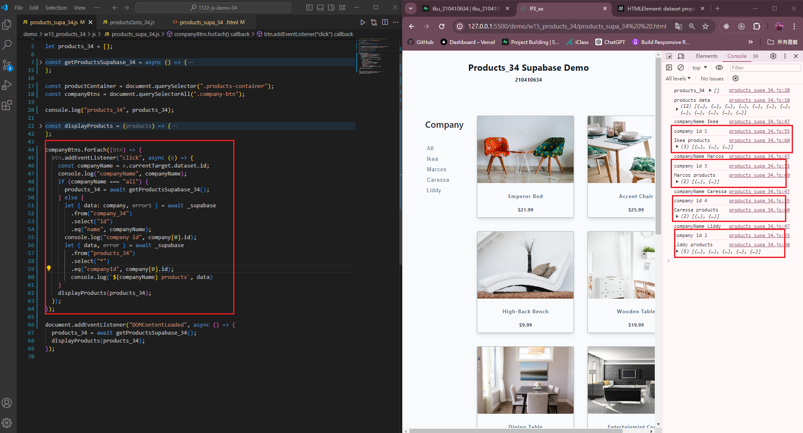
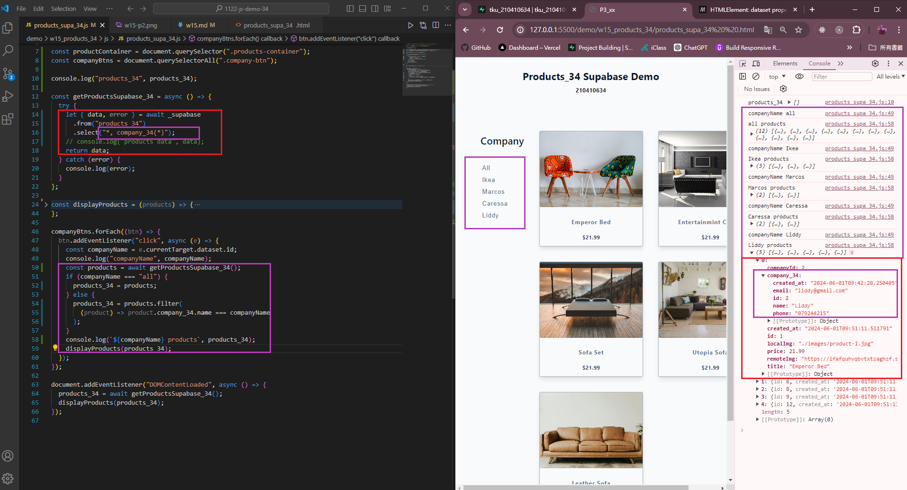
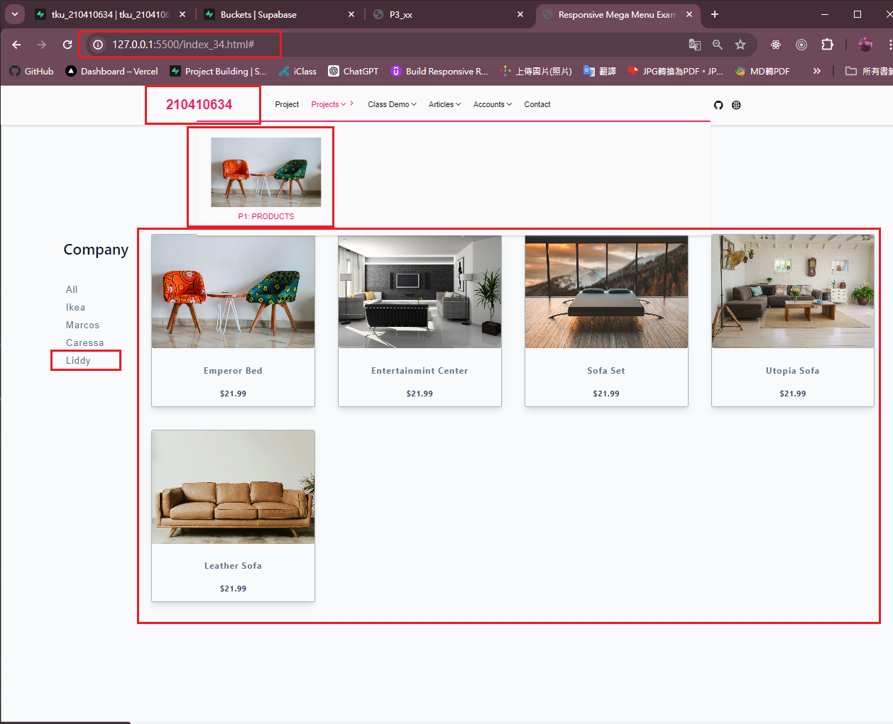
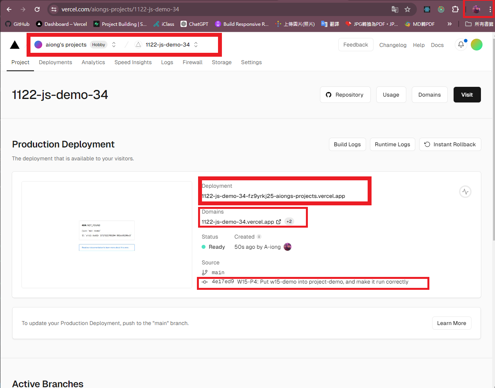
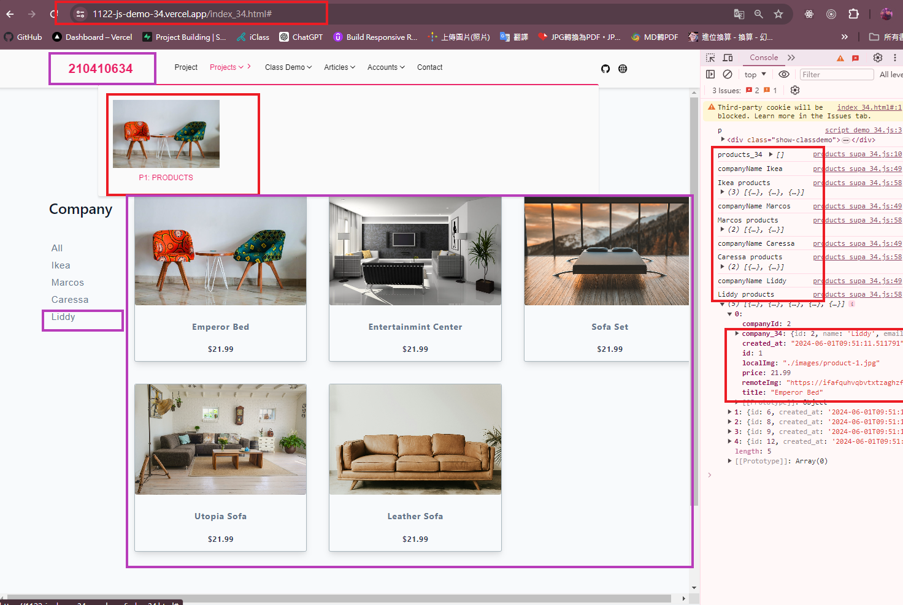

### Video: W15-P1: Create company (filter) menu using scss


```
fab31de A-iong  Sun Jun 2 16:51:26 2024 +0800   W15-P1: Create company (filter) menu using scss
```

### Video: W15-P2: Implement company filter functions, test for each company



```
bfe543e A-iong  Sun Jun 2 17:24:07 2024 +0800   W15-P2: Implement company filter functions, test for each company
```

Video: W15-P3: Implement company filter functions, test for each company using direct filtering of the products containing company data



```
70ca779 A-iong  Sun Jun 2 17:31:39 2024 +0800   W15-P3: Implement company filter functions, test for each company using
```

Video: W15-P4: Put w15-demo into project-demo, and make it run correctly

#### => local




#### => Vercel





```

```
